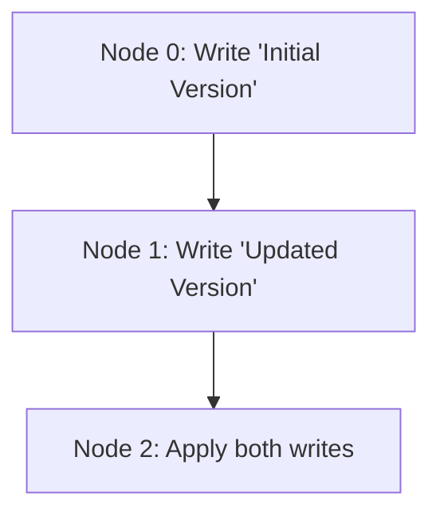

## **Causal Consistency Experiment**

**Causal consistency** is a consistency model in distributed systems where operations are guaranteed to be observed in the order of their causal relationships. If one operation is causally related to another, the system ensures they are applied in that order across all nodes.

This model is particularly useful in scenarios like collaborative tools, version control systems, and messaging applications, where maintaining causality is more important than strict ordering or immediate consistency.

----------

### **1. Implementing a Versioning System with Vector Clocks**

#### **Vector Clocks Overview**

Vector clocks are a data structure used to track causal relationships in distributed systems. Each node maintains a vector of counters, where:

-   Each counter corresponds to a node.
-   The counter is incremented whenever the node performs an operation.
-   Vector clocks are exchanged during communication to establish causal order.

#### **Environment Setup**

Install Python if not already installed. No additional libraries are needed for this experiment.

#### **Code Implementation**

Below is a Python implementation of a causal consistency system using vector clocks. Each node tracks its version and ensures operations respect causal order.

```python
import json
from flask import Flask, request, jsonify

app = Flask(__name__)

# Node-specific configuration
NODE_ID = None
PEERS = []
VECTOR_CLOCK = {}

# Local store with versioned entries
store = {}

# Initialize vector clock
def init_vector_clock():
    global VECTOR_CLOCK
    VECTOR_CLOCK = {peer: 0 for peer in [NODE_ID] + PEERS}

# Increment vector clock for this node
def increment_clock():
    VECTOR_CLOCK[NODE_ID] += 1

# Merge received vector clock
def merge_clocks(received_clock):
    for node, value in received_clock.items():
        VECTOR_CLOCK[node] = max(VECTOR_CLOCK.get(node, 0), value)

# Check if an operation is causally consistent
def is_causally_consistent(received_clock):
    for node, value in received_clock.items():
        if VECTOR_CLOCK.get(node, 0) < value:
            return False
    return True

# API to handle write operations
@app.route('/write', methods=['POST'])
def write():
    data = request.get_json()
    key, value = data['key'], data['value']

    increment_clock()
    store[key] = {'value': value, 'vector_clock': VECTOR_CLOCK.copy()}
    print(f"Write operation at {NODE_ID} -> {key}: {value} | Clock: {VECTOR_CLOCK}")
    
    # Propagate changes to peers
    for peer in PEERS:
        try:
            payload = {'key': key, 'value': value, 'vector_clock': VECTOR_CLOCK.copy()}
            requests.post(f"{peer}/replicate", json=payload)
        except Exception as e:
            print(f"Error propagating to {peer}: {e}")
    
    return jsonify({"status": "success"}), 200

# API to handle replicated data
@app.route('/replicate', methods=['POST'])
def replicate():
    data = request.get_json()
    key, value = data['key'], data['value']
    received_clock = data['vector_clock']

    if is_causally_consistent(received_clock):
        merge_clocks(received_clock)
        store[key] = {'value': value, 'vector_clock': received_clock}
        print(f"Replicated at {NODE_ID} -> {key}: {value} | Clock: {VECTOR_CLOCK}")
        return jsonify({"status": "success"}), 200
    else:
        print(f"Operation at {NODE_ID} is not causally consistent and was skipped.")
        return jsonify({"status": "failure", "message": "Causally inconsistent"}), 400

if __name__ == '__main__':
    import sys
    NODE_ID = sys.argv[1]
    PEERS = sys.argv[2:]
    init_vector_clock()
    print(f"Starting node {NODE_ID} with peers {PEERS}")
    app.run(port=5000 + int(NODE_ID), debug=True)
```

----------

### **2. Running the Experiment**

#### **Step 1: Start Nodes**

Run three instances of the script to simulate distributed nodes:

```bash
python causal_consistency.py 0 http://localhost:5001 http://localhost:5002
python causal_consistency.py 1 http://localhost:5000 http://localhost:5002
python causal_consistency.py 2 http://localhost:5000 http://localhost:5001
``` 

Each node (0, 1, 2) has a unique ID and is aware of its peers.

#### **Step 2: Perform Writes**

Send a write request to Node 0:

```bash
curl -X POST -H "Content-Type: application/json" -d '{"key": "doc1", "value": "Initial Version"}' http://localhost:5000/write
```

Send a causally dependent write to Node 1 after some time:

```bash
curl -X POST -H "Content-Type: application/json" -d '{"key": "doc1", "value": "Updated Version"}' http://localhost:5001/write
```

#### **Step 3: Verify Causal Consistency**

Access Node 2’s state and check if the operations have been applied in causal order:

```bash
curl http://localhost:5002/store
```

You’ll observe that updates are applied in the correct order, respecting causal relationships.

----------

### **3. Collaborative Editing Example**

Causal consistency is crucial for collaborative tools like document editors. For example:

-   **User A** edits a document, adding "Line 1".
-   **User B** sees and edits "Line 1", adding "Line 2".
-   The system ensures User A’s change is visible to User B before applying their edit.

Without causal consistency, "Line 2" could appear without "Line 1", leading to incorrect states.

----------

### **4. Visualization of Causal Relationships**

Here’s a **Diagram** showing the causal relationships:



This demonstrates that Node 1’s update depends on Node 0’s operation, and Node 2 ensures the correct order.

----------

### **5. Summary**

In this experiment:

-   **Causal consistency** ensures that operations are applied respecting their causal dependencies.
-   **Vector clocks** effectively track and enforce causal relationships across distributed nodes.
-   This model is ideal for systems like Git or collaborative editing tools, where preserving operation order is essential.